### Hi there 👋

🔭 I’m currently working on PingCAP.

🌱 I'm currently learning database, go, rust and other interesting things.

<p align="center">
	<a href="https://www.hawkingrei.com/"></a>
	<a href="https://x.com/suohawking"></a>
	<a href="https://www.linkedin.com/in/hawkingrei/"></a>
	<a href="https://komarev.com/ghpvc/?username=hawkingrei"></a>
</p>


Wechat ID

```
echo -n 'aGF3a2luZ3JlaQo=' | base64 -d
```


<a href="https://github.com/hawkingrei">
  
</a>
